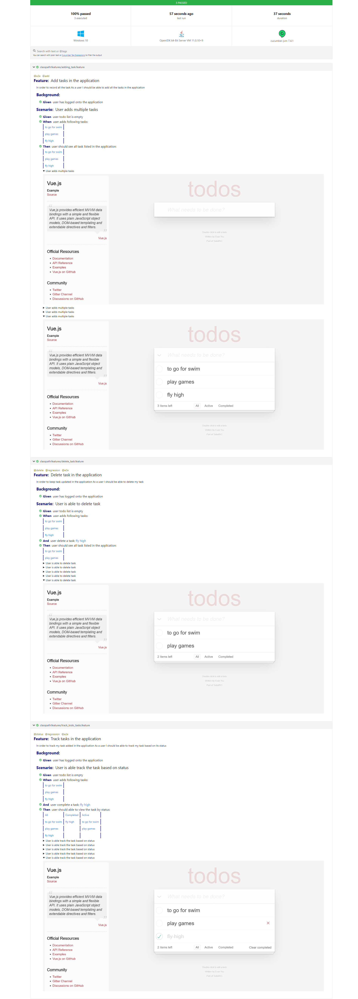
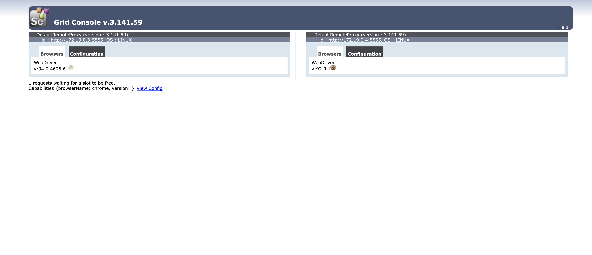

# singtel-challenge
Todo MVC application under test

###A test framework using spring framework 

## Stack

| Category       | Value          |
| -------------- | ---------------|
| Language       | Java           | 
| BuildTool      | Maven          | 
| BDD            | cucumber       | 
| DI             | Spring         | 
| TestFramework  | TestNG         | 
| Reporting      | cucumber       |
|Containerization| Docker         |

## Framework Supports

| OS        | Browsers      |Run Modes| Screenshots            |Parallelism|
| --------- | --------------|---------|------------------------|-----------|
| Mac       | Chrome/Firefox| UI/grid | On every test step     | Yes       |
| Windows   | Chrome/Firefox| UI/grid | On every test step     | Yes       | 

## Scenarios Covered
* Add Task
* Track Task based on status
* Delete task

## Approach

Brief description on the important packages.

### features
* Spring SimpleThreadScope is leveraged to achieve parallel test.
* Spring AOP is introduced for managing services.
* All data are model as a business entity
* Page objects and interactions are maintained ui_layer package
* Java Reflections is used for grouping and abstractions.
* All pages are built as a group of components which are reusable across applications.

### Run Test
Tests can be run on local and support for selenium grid execution.
 
Support parallel execution  -

feature tags -
@e2e, @regression

browser option -
chrome, firefox

spring profiles -
* default - application.properties
* grid - application-remote.properties

Run tests in local:
```$xslt
mvn clean test -Dbrowser=chrome -Dcucumber.filter.tags="@e2e"
```
Run tests in grid:
```$xslt
mvn clean test -Dspring.profiles.active=remote -Dbrowser=chrome -Dcucumber.filter.tags="@e2e"
```


### Reports
Cucumber reports generated after tests run:
refer to report path : target>>cucumber-report.html

Sample screen shot of report for the execution below:



### Selenium Grid Test Execution



### Docker
Docker setup for selenium grid infrastructure for the test execution
to refer docker-compose.yaml file.